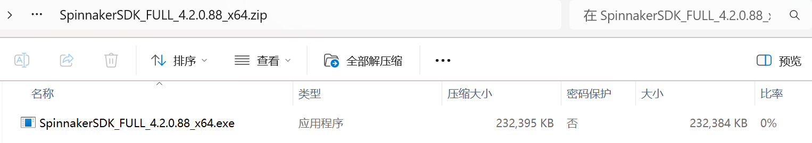

# TeledyneCam
Please email me <swllen25@gamil.com> if there are any bugs in the code

> Camera: ORX-10GS-32S4M-C
> 
> All the introduction is based on this camera
---
## Installation

> **GUI/SDK/Python package Installation**
> 
> Resource Link -> [SDK Resource](https://www.teledynevisionsolutions.com/products/spinnaker-sdk/?model=Spinnaker%20SDK&vertical=machine%20vision&segment=iis)
>
> Official Oryx Installation Guide -> [Official Oryx Installation Guide](https://softwareservices.flir.com/ORX-10GS-32S4/latest/40-Installation/Welcome.htm)

1. Download `Windows Full` and `Python 3.x` based on your PC.


2. Download the software after downloading the `Windows Full` file.


3. Create a python environment and choose the version of the python based on the packages you downloaded.

     For example:

     `conda create -n TeledyneCam python=3.10`

     `conda activate TeledyneCam`
         
     `pip install path_to_your_file/spinnaker_python-4.2.0.88-cp310-cp310-win_amd64.whl` 

4. Install `requirements.txt`

     `pip -r install requirements.txt`

---
## Establish connection to your camera

1. Run this GUI application and allocate IP adress to `ORX-10GS-32S4M-C` camera


1. Check whether the camera can be used normally in GUI.
---
## Control Camera Via Python Code 
> All the function provides details of the usage in `TeledyneCam.py`, you can view this file to learn more details.

---
### Quick start of this Camera
> JupyNotebook is provided in file `Spinnaker_PySpin_Example.ipynb`
>
---
1. Download the file `TeledyneCam.py`, which contains the camera class I packaged.

2. Import the `SpinnakerCamera class` to your own script or notebook.

    ```python
    from TeledyneCam import SpinnakerCamera
    ````

3. Open the camera
   - Choose the pixel format when you create an carema object
   - Open the camera
   - To make sure that the ADC sampling is corresponding to your choosen pixel format, please set adc bit depth.

    **You should check the pixel format and bit depth camera supports first in GUI**

    ```python
     cam = SpinnakerCamera(pixel_format="Mono12p")
     cam.open()
     cam.set_adc_bitdepth("Bit12")
    ```

4. Basic Parameters Setting

    - Exposure Time
    - Gamma
    - Gain
    - ROI

    ```python
    cam.set_exposure(auto=False, time_us=2000)   # microseconds
    cam.set_gain(auto=False, gain_db=0)          # defult: leave gain disabled
    cam.set_gamma(enable=False, gamma=None)      # defult: leave gamma disabled
    # ROI example: set centered ROI 600x400 or comment this out to keep full frame
    cam.set_roi(0, 0, 600, 400, center=True)     
    ```


5. Start acquisition and acquire frame

    ```python
    # Optional: for feedback control to always use the latest frame
    cam.set_latest_only(buffer_count=3)

    cam.start_acquisition()
    frame = cam.grab_numpy(timeout_ms=1000)
    cam.stop_acquisition()

    print("Frame shape:", frame.shape)
    print(np.max(frame))
    cv2.imshow("Frame", frame)
    cv2.waitKey(0) 
    ```

6. Close and release
    ```python
    cam.close()
    ```